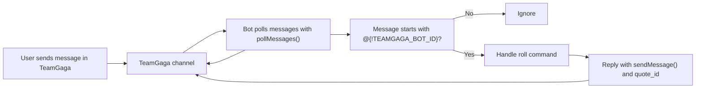

# TeamGaga Bot Example

A tiny TeamGaga bot demo for beginners, built for the [getting started guide](https://open.teamgaga.com/docs/quick-overview/getting-started). It polls channel messages, listens for messages that start with `@{!TEAMGAGA_BOT_ID}`, and replies to `roll` with a dice result.

## Setup
First clone the project:
```bash
git clone https://github.com/AlbertaMoulton/teamgaga-example-app.git

```
Then navigate to its directory and install dependencies:


```bash
cd teamgaga-example-app
bun install
cp .env.sample .env
```
## Get app credentials
Fetch the credentials from your app's settings and add them to a .env file (see .env.sample for an example).

Fill in `.env`:

```text
TEAMGAGA_BOT_ID=<YOUR_BOT_ID>
TEAMGAGA_BOT_TOKEN=<YOUR_BOT_TOKEN>
POLL_INTERVAL_MS=3000
```

## Run

```bash
bun run start
```

## Message Flow



This demo currently listens for messages by polling. Keep `POLL_INTERVAL_MS` at `3000` or higher unless you have a good reason to change it. A very short interval can send too many requests.

## Chat Command

```text
@{!YOUR_BOT_ID} roll
```

Example reply:

```text
You rolled 4.
```
