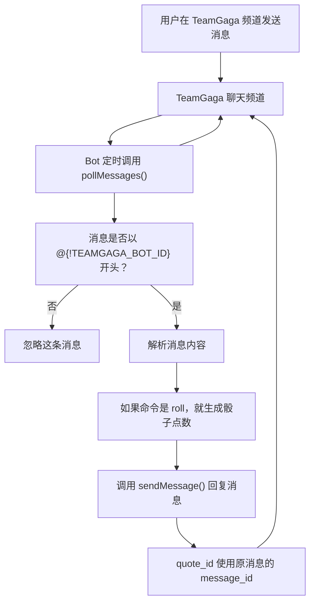

一步一步教你构建你的第一个 `TeamGaga` Bot。

这个示例会做一个很小的骰子 Bot：用户在聊天频道里提到 Bot，并发送 `roll`。Bot 会掷一个骰子，然后回复点数。

### 步骤 0：项目设置

如果你还没有安装 `bun`，请先[安装](https://bun.com)它。

克隆示例项目并安装依赖：

```bash
git clone https://github.com/AlbertaMoulton/teamgaga-example-app.git
cd teamgaga-example-app
bun install
```

### 步骤 1：创建并添加应用

1. 打开开发者门户并[创建一个应用](https://open.teamgaga.com/applications?new_application=true)。
2. 在应用设置页面找到 Bot 的 ID 和 Token。
3. 把应用添加到你的测试社区。

### 步骤 2：配置凭据

复制环境变量示例文件：

```bash
cp .env.sample .env
```

然后编辑 `.env`：

```text
TEAMGAGA_BOT_ID=<YOUR_BOT_ID>
TEAMGAGA_BOT_TOKEN=<YOUR_BOT_TOKEN>
POLL_INTERVAL_MS=3000
```

说明：

- `TEAMGAGA_BOT_ID` 用来判断消息是否以 `@{!TEAMGAGA_BOT_ID}` 开头。
- `TEAMGAGA_BOT_TOKEN` 用来调用 TeamGaga Bot API。
- `POLL_INTERVAL_MS` 是轮询间隔，默认可以保持 `3000`。

目前 Bot 只能通过轮询方式监听消息，也就是不断调用 `pollMessages()` 查询是否有新消息。建议保持默认的 `3000ms` 或更长，不要把轮询间隔设置得太短，否则会产生过于频繁的 API 请求。

### 步骤 3：运行 Bot

```bash
bun run start
```

启动后，Bot 会循环调用 `pollMessages()` 拉取频道消息。

消息处理流程如下：



### 步骤 4：在聊天频道中测试

在 TeamGaga 聊天频道里发送：

```text
@{!YOUR_BOT_ID} roll
```

Bot 收到消息后会：

1. 检查消息内容是否以 `@{!TEAMGAGA_BOT_ID}` 开头。
2. 判断命令是否是 `roll`。
3. 使用 `sendMessage()` 回复点数。

`sendMessage()` 的 `quote_id` 会传入用户消息的 `message_id`，这样 TeamGaga 会把 Bot 的消息显示为对原消息的回复。

示例回复：

```text
You rolled 4.
```
